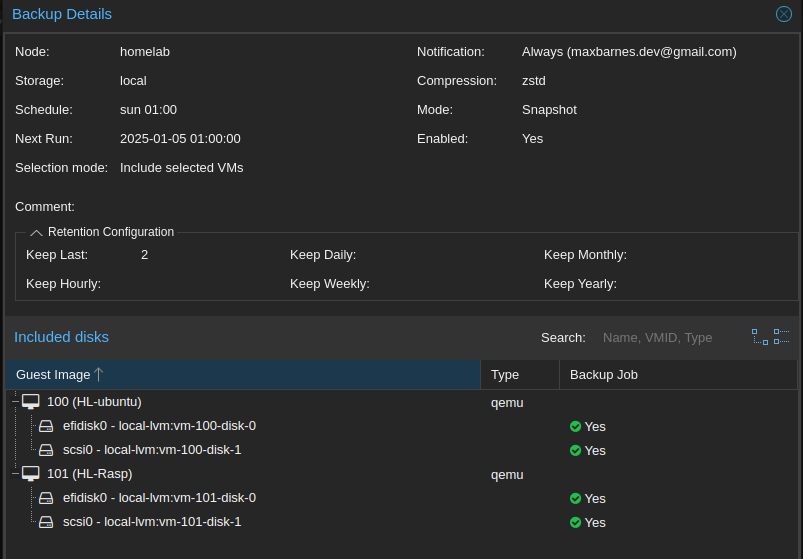

# My Homelab Project Goals

This is the beginning of my home lab project (12-23-24). 
# Hardware

| Beelink S12      | Mini PC |
| ----------- | ----------- |
| Processor | Intel (R) N100 800mhz |
| RAM   | 16GB |
| SSD  | 500GB |
| Hypervisor | Proxmox |
# Networking
Eventually implement Networking (New Router, DHCP Server, Firewalls)
# Backups

