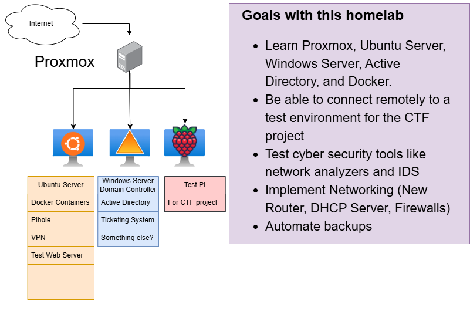
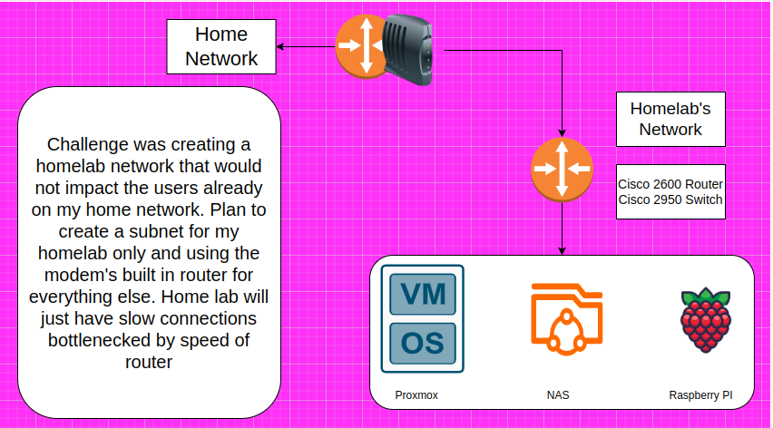

# My Homelab Project Goals

This is the beginning of my home lab project (12-23-24). 
# Hardware

| Beelink S12      | Mini PC |
| ----------- | ----------- |
| Processor | Intel (R) N100 800mhz |
| RAM   | 16GB |
| SSD  | 500GB |
| Hypervisor | Proxmox |

# Networking

Cisco 2600 Series Router

Cisco 2950 Switch

# Backups

Backups automated through proxmox. Will connect them to NAS when I can afford the hardware.

# Scripts

Doing scripts for fun and from roadmap.sh. This will help me learn more DevOps and integrate it into my homelab

[Server Stats Script](./scripts/devops/stats.sh)

https://roadmap.sh/projects/server-stats
